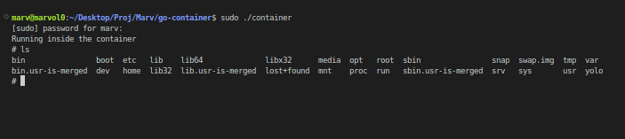

# go-container
This project demonstrates how to create a basic container from scratch using the Go programming language. It covers the use of Linux namespaces, cgroups, and the `pivot_root` system call to isolate processes.

## Table of Contents
- [Introduction](#introduction)
- [Prerequisites](#prerequisites)
- [Installation](#installation)
- [Usage](#usage)
- [Project Structure](#project-structure)


### Introduction
Containers provide process and filesystem isolation, making them essential for modern application deployment and management. This project shows how to build a simple container runtime that isolates a process using Go.

### Prerequisites

- Linux environment (required for namespaces and cgroups)
- Go 1.16+ installed
- Root privileges for certain operations

### Installation
1. **Clone the Repository**
```bash
git clone https://github.com/m-murithi/go-container.git
cd go-container
```

2. **Set Up Go Modules**
Initialize the Go module if not already done
```bash
go mod init example.com/mymodule
```

3. **Build the Project**
```bash
go build -o container
```

### Usage
1. **Prepare the Root Filesystem:**
Ensure the `rootfs` directory is set up with necessary files (binaries, libraries, etc.).

2. **Run the Container**
```bash
sudo ./container
```

### Project Structure
```plaintext
go-container
├── main.go # Entry point of the application
├── cgroup.go # Handles cgroup setup
├── filesystem.go # Handles filesystem setup and pivot_root
├── README.md # Project documentation
├── LICENSE # License information
├── rootfs # Root filesystem directory
│ ├── bin
│ ├── lib
│ ├── lib64
│ ├── etc
│ ├── usr
│ ├── ...
├── scripts # Helper scripts
│ └── setup.sh # Example setup script
└── .gitignore # Git ignore file

```


